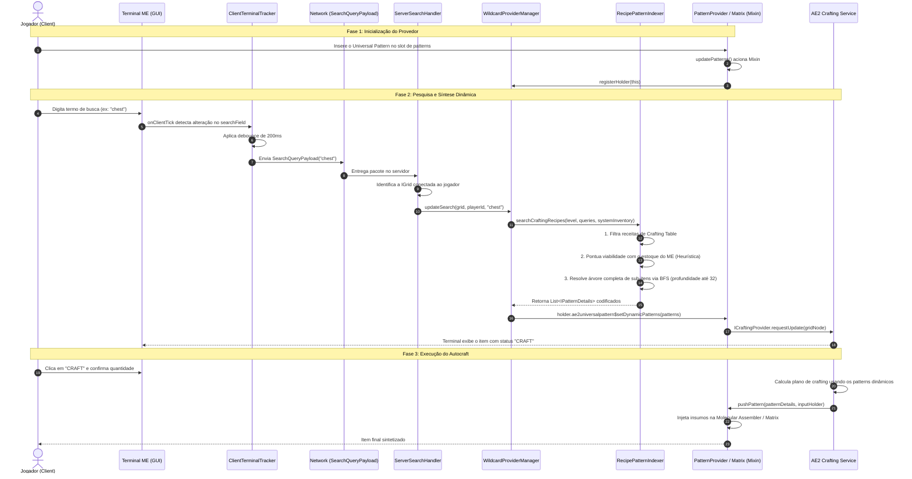

# Documentação Arquitetural e Técnica — AE2 Universal Pattern

**Mod ID:** `ae2universalpattern`  
**Nome do Mod:** AE2 Universal Pattern  
**Minecraft:** 1.21.1  
**Loader:** NeoForge (>= 21.1.251)  
**Dependências:** Applied Energistics 2 (19.2.17+), ExtendedAE (opcional)  
**Licença:** MIT  

---

## 1. Visão Geral e Objetivo

O **AE2 Universal Pattern** é um mod addon para o **Applied Energistics 2 (AE2)** no Minecraft 1.21.1. O seu propósito fundamental é eliminar a necessidade de os jogadores codificarem manualmente centenas ou milhares de *Crafting Patterns* individuais para receitas de **Crafting Table** (vanilla e de qualquer mod).

Em vez de criar e armazenar milhares de itens físicos de padrões ou registrar estaticamente todas as dezenas de milhares de receitas do modpack (o que causaria lentidão, sobrecarga de memória e poluição visual nos terminais), o mod introduz o conceito de **Padrão Universal Dinâmico** (*Universal Crafting Pattern*).

### Como o jogador interage:
1. O jogador fabrica um único **Universal Pattern** (`ae2universalpattern:wildcard_pattern`) usando 4 Blank Patterns + 1 Crafting Table.
2. Insere esse padrão em qualquer **Pattern Provider** do AE2 ou dentro de uma **Assembler Matrix** do ExtendedAE.
3. Ao abrir o Terminal ME / Crafting Terminal e digitar o que deseja fabricar (ex: `chest`, `1048m`, `gear`, `piston`), o mod intercepta a pesquisa, analisa o inventário do ME em tempo real e sintetiza dinamicamente na rede todos os padrões de autocrafting necessários, incluindo toda a árvore de subcomponentes.

---

## 2. Mapa dos Componentes e Pacotes

```
com.example.ae2universalpattern
├── AE2UniversalPatternMod.java             # Ponto de entrada do mod (@Mod), registros de itens e eventos do ciclo de vida
├── client
│   └── ClientTerminalTracker.java         # Rastreamento client-side da barra de busca do terminal ME com debounce
├── crafting
│   ├── IWildcardPatternHolder.java        # Interface de contrato para blocos/lógicas que hospedam o padrão universal
│   ├── RecipePatternIndexer.java          # Motor de busca, heurística de inventário e resolução em grafo BFS
│   ├── WildcardPatternDecoder.java        # IPatternDetailsDecoder para validação de segurança do item de padrão
│   └── WildcardProviderManager.java       # Gerenciador central de provedores ativos por IGrid e orquestrador de cache
├── item
│   └── WildcardPatternItem.java           # Classe do item Universal Crafting Pattern com tooltips informativos
├── mixin
│   ├── AE2UniversalPatternMixinPlugin.java# Plugin do Mixin: ativação condicional para integração com mods opcionais
│   ├── MixinPatternProviderLogic.java     # Injeção no Pattern Provider do AE2
│   └── extendedae
│       ├── MixinGuiAssemblerMatrix.java   # Compatibilidade de busca na GUI da Assembler Matrix
│       ├── MixinTileAssemblerMatrixPattern.java       # Injeção na lógica multiblock da Assembler Matrix
│       └── MixinTileAssemblerMatrixPatternFilter.java # Permissão de inserção do item no filtro da Matrix
└── network
    ├── SearchQueryPayload.java            # CustomPacketPayload contendo a string de pesquisa
    └── ServerSearchHandler.java           # Processador server-side de rede para despachar a busca para a IGrid do ME
```

---

## 3. Fluxo de Execução Completo (End-to-End Workflow)



---

## 4. Detalhamento dos Componentes do Sistema

### 4.1. `WildcardPatternItem` e `WildcardPatternDecoder`
- **Registro:** `ae2universalpattern:wildcard_pattern`.
- **Propriedades:** `stacksTo(1)`.
- **Tooltips:** Explicações em `en_us` e `pt_br` orientando a inserção em Pattern Providers ou Assembler Matrix.
- **Decoder:** `WildcardPatternDecoder` implementa `IPatternDetailsDecoder`. É registrado no setup comum do mod (`FMLCommonSetupEvent`) em `PatternDetailsHelper.registerDecoder(...)`. Garante que o AE2 reconheça o item como um padrão sem lançar exceções de NBT ou tentar decodificá-lo de forma estática.

### 4.2. `ClientTerminalTracker` (Client-Side)
- Monitora a interface gráfica ativa via evento `ClientTickEvent.Post`.
- Verifica se a tela aberta é uma instância de `MEStorageScreen<?>` (abrange Terminal de Armazenamento, Terminal de Crafting, Terminais sem fio, etc.).
- Extrai o texto pesquisado via reflexão segura de campos internos do AE2:
  1. `MEStorageScreen.repo` (`Repo.getSearchString()`).
  2. `MEStorageScreen.searchField` (`EditBox.getValue()`).
  3. Varredura recursiva de filhos (`screen.children()`) como fallback.
- **Otimizações:**
  - Envio imediato se o terminal acabou de abrir ou se o texto foi limpo.
  - **Debounce de 200 ms** enquanto o jogador está digitando continuamente, evitando flood de pacotes na rede e recálculos desnecessários no servidor.

### 4.3. Rede (`SearchQueryPayload` & `ServerSearchHandler`)
- **Protocolo:** Registrado via `RegisterPayloadHandlersEvent` usando o sistema oficial do NeoForge 1.21.1:
  - `ResourceLocation`: `ae2universalpattern:search_query`.
  - Codec: `ByteBufCodecs.STRING_UTF8`.
- **Resolução de Grade no Servidor:**
  - O `ServerSearchHandler` obtém o `player.containerMenu`.
  - Se for um `MEStorageMenu`, obtém o `hostNode.getGrid()`.
  - Despacha a atualização para o `WildcardProviderManager` apenas para a grade ME à qual o jogador está conectado.

### 4.4. `WildcardProviderManager` (Server-Side)
- Mantém o estado dinâmico da rede ME sem risco de vazamento de memória (*memory leaks*):
  - `ACTIVE_HOLDERS`: `Collections.newSetFromMap(new WeakHashMap<>())`.
  - `GRID_PLAYER_QUERIES`: Mapeia cada grade para os termos digitados por cada jogador conectado.
  - `GRID_PATTERNS`: Cache dos padrões ativos por grade.
- **Proteção contra travamento durante execução (`isGridBusy`):**
  - Antes de substituir os padrões ativos, verifica se alguma CPU de crafting da grade está ocupada (`cpu.isBusy()`) ou se algum provedor está despachando trabalho (`cp.isBusy()`).
  - Se a grade estiver ocupada executando um autocraft, os padrões novos são **mesclados** aos padrões existentes em vez de substituí-los abruptamente. Isso impede que receitas sejam deletadas do grafo no meio de uma ordem de crafting em andamento!

---

## 5. Motor de Grafo e Algoritmo de Indexação (`RecipePatternIndexer`)

O `RecipePatternIndexer` é o núcleo algorítmico do mod. Ele é responsável por selecionar as receitas relevantes e construir uma árvore completa de subcrafting instantaneamente.

### 5.1. Cache Central de Receitas
- `getRecipesByOutput(Level)`: Varre todas as receitas registradas no `RecipeManager` sob `RecipeType.CRAFTING` e as organiza em um `Map<Item, List<RecipeHolder<CraftingRecipe>>>`.
- Receitas especiais (ex: reparo de ferramentas, coloração de armaduras) são filtradas via `recipe.isSpecial()`.
- Invalidado automaticamente quando ocorre recarga de datapacks (`/reload` ou `OnDatapackSyncEvent`).

### 5.2. Sistema de Pontuação Heurística de Disponibilidade (`getItemScore`)
Cada item recebe uma pontuação (`score`) calculada com base no inventário real do sistema ME:
- **Tier 0 (Em Estoque):** Se o item existe no inventário do ME (`systemInventory > 0`), sua pontuação base é $\ge 10.000.000 + \min(\text{stock}, 1.000.000) \times 10$.
- **Tier 1+ (Craftável a partir do ME):** Se todos os insumos podem ser produzidos a partir de materiais em estoque, a receita ganha pontuação $\ge 1.000.000$, com leve amortização por profundidade para priorizar caminhos mais curtos.
- **Tier Parcial:** Se possui alguns ingredientes no sistema ME, pontuação entre $200$ e $10.000$.
- **Tier Sem Recursos:** Possui receita válida na Crafting Table, mas faltam materiais no ME ($score = 100$).
- **Tier Sem Receita:** Item básico sem receita de bancada ($score = 1$).
- **Bônus Vanilla:** $+10$ pontos para itens com namespace `minecraft`, garantindo desempate prioritário para itens clássicos em tags com múltiplas alternativas modadas.

### 5.3. Filtragem de Receitas Inferiores Concorrentes
Se para um mesmo item de saída existe uma receita plenamente realizável com os recursos do ME ($score \ge 100.000$), qualquer variante impossível de fabricar ($score < 100.000$) é descartada.
> **Exemplo Prático:** Para fabricar um Livro (`minecraft:book`), o modpack ATM10 possui receitas usando Papel + Couro ou Papel + Papelão (*cardboard*). Se o jogador possui essência de vaca ou couro no sistema ME, a receita de couro ganha score alto e a receita de papelão é suprimida, garantindo que o AE2 não exija materiais que o jogador não possui.

### 5.4. Resolução Completa da Árvore via BFS Iterativo (`buildCompleteTreeBfs`)
Diferente de abordagens recursivas ingênuas que geram estouro de pilha (*StackOverflowError*) ou travamentos em árvores complexas, o mod utiliza **Busca em Largura (BFS) Iterativa** orientada a fila (`Queue<QueuedItem>`):
1. **Deduplicação de Estados:**
   - `queuedItems` (`Set<Item>`): Cada item só pode entrar na fila BFS uma única vez por varredura.
   - `encodedRecipes` (`Set<RecipeHolder<CraftingRecipe>>`): Evita recodificar a mesma receita.
   - `seenPatternKeys` (`Set<AEItemKey>`): Evita itens de padrão duplicados na lista final.
2. **Ciclos de Conversão Bidirecional (Compactação/Descompactação de Metais):**
   - Metais possuem laços intrínsecos no Minecraft (9 pepitas $\leftrightarrow$ 1 barra $\leftrightarrow$ $\frac{1}{9}$ bloco).
   - O algoritmo permite até 2 receitas por sub-item no BFS.
   - Quando `bestSubScore < 100.000`, ambas as receitas (ex: `bloco -> barras` e `pepitas -> barra`) são encodadas e seus insumos (`bloco` e `pepita`) são enfileirados no BFS.
   - Na iteração seguinte da fila, a pepita gera `1 barra -> 9 pepitas` e o bloco gera `9 barras -> 1 bloco`.
   - **Resultado:** Todas as pontes de conversão ficam 100% disponíveis no plano de crafting, garantindo que "Faltando: Pepita de Ferro" nunca ocorra se o jogador possuir barras ou blocos.
3. **Limites e Segurança Operacional:**
   - Profundidade máxima de BFS (`MAX_BFS_DEPTH`): **32 níveis** (suporta cadeias extremas como células de 1048M / 256M que ultrapassam 12 tiers).
   - Limite de receitas primárias: **60 receitas**.
   - Limite total de padrões dinâmicos por grade: **1500 padrões**.

---

## 6. Integração com Mixins

O mod não altera o código original do AE2 ou do ExtendedAE em disco; ele utiliza Mixins no runtime:

### 6.1. Mixins do Applied Energistics 2
- **`MixinCraftingCpuLogic`** (Alvo: `appeng.crafting.execution.CraftingCpuLogic`):
  - `@Inject(method = "trySubmitJob", at = @At("RETURN"))`:
    - Intercepta a submissão e início de trabalhos de autocrafting confirmados pelo jogador.
    - Captura todos os padrões da árvore executada (`plan.patternTimes().keySet()`) e os registra permanentemente no `WildcardProviderManager` e no NBT do `WildcardPatternItem`.
- **`MixinPatternProviderLogic`** (Alvo: `appeng.helpers.patternprovider.PatternProviderLogic`):
  - Implementa a interface `IWildcardPatternHolder`.
  - `@Inject(method = "updatePatterns", at = @At("RETURN"))`:
    - Percorre o inventário do Pattern Provider.
    - Se encontrar `WildcardPatternItem`, marca `hasWildcard = true`, recupera as receitas salvas no NBT do item e registra o provedor no `WildcardProviderManager`.
    - Se o item for removido, desregistra o provedor e limpa os padrões dinâmicos da lista interna.
  - `@Inject(method = "onMainNodeStateChanged", at = @At("RETURN"))`: Garante re-registro quando o bloco é conectado à grade ME.
  - `@Inject(method = "pushPattern", at = @At("HEAD"))`: Garante que, caso o pattern fornecido dinamicamente seja despachado para crafting, ele seja reconhecido na lista interna e gravado como receita permanente caso ainda não seja.

### 6.2. Mixins do ExtendedAE (Opcional / Multiblock Assembler Matrix)
- **`AE2UniversalPatternMixinPlugin`**:
  - Verifica dinamicamente se o mod `extendedae` está instalado via `ModList.get().isLoaded("extendedae")`. Se não estiver presente, as classes de mixin do ExtendedAE são ignoradas com segurança, evitando falhas de carregamento (*NoClassDefFoundError*).
- **`MixinTileAssemblerMatrixPattern`** (Alvo: `com.glodblock.github.extendedae.common.tileentities.matrix.TileAssemblerMatrixPattern`):
  - Implementa `IWildcardPatternHolder` na entidade multiblock da Assembler Matrix.
  - Detecta a presença do Universal Pattern na matriz e injeta os padrões dinâmicos diretamente no provedor da estrutura multiblock de alta velocidade.
- **`MixinTileAssemblerMatrixPatternFilter`** (Alvo: `TileAssemblerMatrixPattern$Filter`):
  - Intercepta `allowInsert` para permitir que o jogador coloque o item `WildcardPatternItem` nos slots de filtro da matriz (que por padrão só aceitam itens de padrão nativos do AE2).
- **`MixinGuiAssemblerMatrix`** (Alvo: `GuiAssemblerMatrix`):
  - Garante que o item seja renderizado e localizado adequadamente na barra de pesquisa interna da GUI da matriz.

---

## 7. Integração com JEI (Just Enough Items) — Click-to-Index (Zero Lag)

Para permitir a integração perfeita com o JEI sem causar nenhum lag durante a digitação na barra de busca do JEI:
1. **`AE2UniversalPatternJeiPlugin`**:
   - Implementa `mezz.jei.api.IModPlugin` anotado com `@JeiPlugin`.
   - Armazena a instância ativa do `IJeiRuntime`.
2. **`ClientTerminalTracker` + `JEIInteractionHelper`**:
   - Ouve o evento de cliente `ScreenEvent.MouseButtonPressed.Pre`.
   - **Condição de ativação obrigatória:** O jogador DEVE estar com um terminal AE2 aberto (`mc.player.containerMenu instanceof MEStorageMenu`, seja terminal de crafting físico ou wireless terminal). Se não houver terminal aberto, a verificação é abortada instantaneamente com custo zero de processamento.
   - **Disparo Exclusivo por Clique:** Nenhuma varredura é feita ao digitar na barra do JEI. Apenas quando o jogador **clica** em uma receita (no `RecipesGui` do JEI) ou em um item da lista do JEI, o alvo é capturado.
   - O cliente envia `JEIRecipeClickPayload` ao servidor com o item e o ID da receita clicada.
3. **Resolução de Componentes no Servidor (`ServerJEIHandler` & `RecipePatternIndexer.indexJeiClickedRecipe`):**
   - O servidor recebe o item clicado e executa a busca de receitas e a resolução completa em grafo BFS de todos os subcomponentes.
   - Os padrões são registrados na grade ME.
   - **Resultado:** Todos os componentes da receita tornam-se imediatamente craftáveis no terminal AE2 (com o botão "CRAFT"), e os botões de transferência de receita (`+`) do JEI reconhecem imediatamente que todos os componentes são craftáveis pela rede!

---

## 8. Gravação Permanente de Receitas e Fallback Dinâmico de Insumos

1. **Gravação Permanente:**
   - Sempre que o jogador inicia um autocrafting ou quando uma receita é despachada para montagem, o padrão é registrado como **Permanente**.
   - O padrão é gravado no NBT/DataComponents (`SavedPatterns`) do próprio item `WildcardPatternItem` e no cache de rede do `WildcardProviderManager`.
   - Quando o jogador quebra a máquina ou move o item para outro provedor/base, todas as receitas gravadas são preservadas no item.
   - O tooltip do item exibe a contagem de receitas salvas (`Receitas Gravadas Permanentemente: X`).
2. **Fallback Dinâmico por Falta de Ingredientes:**
   - Durante a atualização dos padrões na grade (`refreshGridPatterns`), o sistema avalia se os ingredientes da receita gravada permanente estão disponíveis no sistema ME (`isPatternCraftable`).
   - Se faltarem materiais e eles não puderem ser produzidos com os itens atuais do ME:
     - O sistema invoca automaticamente `RecipePatternIndexer.searchCompatibleFallback`.
     - Executa uma busca rápida por receitas alternativas compatíveis para aquele mesmo item final cujos ingredientes estejam disponíveis em estoque.
     - Sintetiza a receita alternativa e sua árvore BFS, disponibilizando-a imediatamente para o jogador craftar sem interrupção.

---

## 9. Estrutura de Arquivos no Repositório

```text
/
├── .github/workflows/build.yml     # Integração Contínua (CI) automática no GitHub (Java 21)
├── gradle/wrapper/                 # Binários e propriedades do Gradle Wrapper (Gradle 9.2.1)
├── src/main/
│   ├── java/com/example/ae2universalpattern/
│   │   ├── AE2UniversalPatternMod.java
│   │   ├── client/
│   │   │   ├── ClientTerminalTracker.java
│   │   │   └── jei/
│   │   │       ├── AE2UniversalPatternJeiPlugin.java
│   │   │       └── JEIInteractionHelper.java
│   │   ├── crafting/
│   │   │   ├── IWildcardPatternHolder.java
│   │   │   ├── RecipePatternIndexer.java
│   │   │   ├── WildcardPatternDecoder.java
│   │   │   └── WildcardProviderManager.java
│   │   ├── item/WildcardPatternItem.java
│   │   ├── mixin/
│   │   │   ├── AE2UniversalPatternMixinPlugin.java
│   │   │   ├── MixinCraftingCpuLogic.java
│   │   │   ├── MixinPatternProviderLogic.java
│   │   │   └── extendedae/
│   │   │       ├── MixinGuiAssemblerMatrix.java
│   │   │       ├── MixinTileAssemblerMatrixPattern.java
│   │   │       └── MixinTileAssemblerMatrixPatternFilter.java
│   │   └── network/
│   │       ├── JEIRecipeClickPayload.java
│   │       ├── SearchQueryPayload.java
│   │       ├── ServerJEIHandler.java
│   │       └── ServerSearchHandler.java
│   ├── resources/
│   │   ├── ae2universalpattern.mixins.json
│   │   ├── ae2universalpattern.refmap.json
│   │   ├── assets/ae2universalpattern/
│   │   │   ├── lang/en_us.json
│   │   │   ├── lang/pt_br.json
│   │   │   └── models/item/wildcard_pattern.json
│   │   └── data/ae2universalpattern/
│   │       └── recipe/wildcard_pattern.json
│   └── templates/META-INF/
│       └── neoforge.mods.toml
├── build.gradle                    # Configuração de build, repositórios e dependências
├── gradle.properties               # Propriedades do mod e versões do NeoForge/Minecraft
├── gradlew                         # Script de inicialização Unix/Linux
├── gradlew.bat                     # Script de inicialização Windows
├── LICENSE                         # Licença MIT
└── README.md                       # Documentação pública do repositório
```

---

## 10. Guias de Manutenção e Extensão Futura

1. **Adicionar Suporte a Outros Tipos de Máquina (Fase 2 opcional):**
   - O mod atual foca deliberadamente em receitas de **Crafting Table** (`RecipeType.CRAFTING`), pois são universais, possuem matriz 3x3 bem definida e são executadas nativamente por Molecular Assemblers e Assembler Matrix.
   - Caso se deseje futuramente estender para fornalhas (`RecipeType.SMELTING`) ou Inscribers do AE2, basta criar um segundo padrão (ex: `UniversalSmeltingPattern`) e mapear os respectivos tipos no `RecipePatternIndexer`.
2. **Ciclo de Vida do Pacote de Pesquisa:**
   - Quando o jogador fecha o terminal ou limpa o campo de busca, uma mensagem vazia `""` é enviada ao servidor.
   - O servidor chama `clearPlayerSearch(playerId)`. Se não houver outros jogadores pesquisando ativamente na mesma grade, o sistema volta ao conjunto básico de padrões (crafting table, tochas, baús, barras de ferro, etc.), economizando memória.
3. **Ambiente de Compilação:**
   - Execute `./gradlew build` para gerar o arquivo `.jar` em `build/libs/ae2universalpattern-1.0.0.jar`.
   - Compatível com hot reload de mixins e datapacks (`/reload`).
